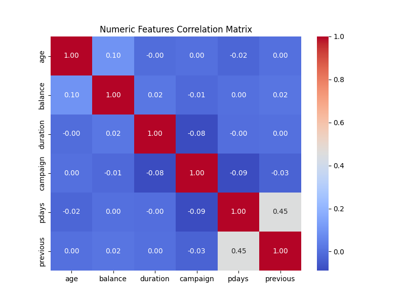
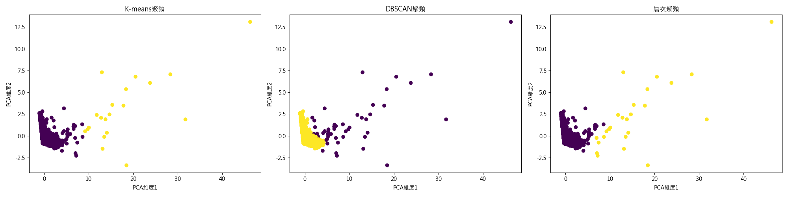

# Data Analysis Practise

本專案包含多種以 Python 進行資料分析與機器學習的範例程式，涵蓋以下主題：

* 資料前處理 (EDA)
* 將 MySQL 資料表匯出為 CSV
* 決策樹(Decision Tree) 與隨機森林(Random Forest) 等傳統機器學習分類
* 支援向量機(SVM)、邏輯回歸(Logistic Regression)、神經網路(MLP) 等分類演算法
* 回歸模型 (Decision Tree Regressor、Random Forest Regressor、SVR、Linear Regression、Neural Network、Polynomial Regression)
* 基於 Transformer 架構的分類/回歸範例 (TabTransformer)
* 非監督式學習：K-means、DBSCAN、階層式聚類 (Hierarchical Clustering)
* 交叉驗證 (KFold、StratifiedKFold)
* 特徵重要性 (Feature Importance)、相關性分析 (Correlation)
* 自動化生成 Profiling 報告 (ydata-profiling / pandas\_profiling)

---

## 專案結構

```
.
├── Classification_Basic.py         # 傳統機器學習分類範例（Decision Tree、Random Forest、SVM、Logistic Regression、MLP）
├── Classification_Transformer.py   # 基於 TabTransformer 的分類範例
├── Regression_Basic.py             # 傳統機器學習回歸範例（Decision Tree Regressor、Random Forest Regressor、SVR、Linear Regression、MLP、Polynomial Regression）
├── Regression_Transformer.py       # 基於 TabTransformer 的回歸範例
├── Clustering_Basic.py             # 聚類分析範例（K-means、DBSCAN、Hierarchical）
├── DecisionTree.py                 # 單獨抽取 Decision Tree 分類並搭配 GridSearchCV 的參考範例
├── EDA_basic.py                    # 資料探索性分析（EDA）範例（可選擇性產生各種圖表、pandas_profiling 報告）
├── convert_mysql_to_csv.py         # 將 MySQL 資料表轉成 CSV 的範例程式
├── README.md                       # 本檔案
├── bank_data.csv                   # (範例) 用於分類任務的銀行行銷資料集
├── student_por.csv                 # (範例) 用於回歸任務的學生成績資料集
├── Online_Retail.csv               # (範例) 用於聚類任務的線上零售(RFM)資料集
└── bank_data_profile.html          # (範例) ydata-profiling 產生的銀行資料分析報告
```

> **註**：
>
> * 如果您使用的是不同檔案名稱，請自行調整程式內 `DATA_FILE`、`TARGET_COLUMN` 等參數。

---

## 資料集下載

以下示範各個範例程式的基本執行方式與參數設定。請先將資料集 (例如 `bank_data.csv`、`student_por.csv`、`Online_Retail.csv`) 放在程式相同目錄下，或修改程式中 `DATA_FILE` 的路徑。
- [分類任務-銀行資料集 (bank_data.csv)](https://archive.ics.uci.edu/dataset/222/bank+marketing)
- [回歸任務-學生成績資料集 (student_por.csv)](https://archive.ics.uci.edu/dataset/320/student+performance)
- [聚類任務-線上零售資料集 (Online_Retail.csv)](https://archive.ics.uci.edu/dataset/352/online+retail)

### 1. 資料探索性分析 (EDA)

```bash
python EDA_basic.py
```

* 在程式開頭可透過布林變數開關 (`PLOT_BASIC_INFO`, `PLOT_NUMERICAL`, `PLOT_CATEGORICAL`, `PLOT_HEATMAP`, `PLOT_PAIRPLOT`, `PLOT_EDA_REPORT`) 控制是否生成對應圖表與自動報告。
* 若要產生自動化報告，請先安裝 `ydata-profiling`，並將 `PLOT_EDA_REPORT = True`。

### 2. MySQL → CSV 轉換

```bash
python convert_mysql_to_csv.py
```

* 程式中 `DB_CONFIG` 參數請依據您本機的 MySQL 設定修改 (`host`, `user`, `password`, `database`)。
* `TABLE_NAME` 設定您要匯出的資料表名稱，執行後會在同目錄下產生 `TABLE_NAME.csv`。

### 3. 傳統機器學習分類 (Classification\_Basic.py)

```bash
python Classification_Basic.py
```

* 使用的分類模型：

  * Decision Tree
  * Random Forest
  * SVM
  * Logistic Regression
  * Neural Network (MLPClassifier)
* 程式會切分 80% 訓練 / 20% 測試，並依序列印各模型的 Accuracy、Precision、Recall、F1-score。

### 4. 基於 TabTransformer 的分類 (Classification\_Transformer.py)

```bash
python Classification_Transformer.py
```

* 使用 PyTorch 建立一個簡易的 TabTransformer 模型，將數值與類別特徵分開處理：

  * 數值特徵經標準化後進入全連接層
  * 類別特徵先經 LabelEncoder，再經 Embedding，送入 Transformer Encoder
  * 最後結合兩者輸出分類結果
* 執行後會印出每個 Epoch 的 Loss，最後印出測試集準確率及詳細分類報告。

### 5. 傳統機器學習回歸 (Regression\_Basic.py)

```bash
python Regression_Basic.py
```

* 使用的回歸模型：

  * Decision Tree Regressor
  * Random Forest Regressor
  * SVR
  * Linear Regression
  * Neural Network Regressor (MLPRegressor)
  * Polynomial Regression (degree=2)
* 程式會切分 80% 訓練 / 20% 測試，並列印各模型的 MSE、RMSE、MAE、Median AE、Explained Variance、R-squared、MAPE。

### 6. 基於 TabTransformer 的回歸 (Regression\_Transformer.py)

```bash
python Regression_Transformer.py
```

* 類似分類版 TabTransformer 架構，將最後一層輸出改為一個實數值 (回歸)。
* 執行過程中每 50 個 Epoch 印出 Loss，最後印出測試集的 MSE、R²、MAE、Median AE、Explained Variance、MAPE 等結果。

### 7. 聚類分析 (Clustering\_Basic.py)

```bash
python Clustering_Basic.py
```

* 讀取 `Online_Retail.csv`，先進行 RFM 特徵工程 (Recency, Frequency, Monetary)。
* 做標準化後，使用以下三種演算法：

  1. K-means (自動搜尋最佳 K 值並計算 Inertia、Silhouette score)
  2. DBSCAN
  3. 階層式聚類 (Hierarchical Clustering)
* 依序列印各演算法的評估指標 (Silhouette, Calinski-Harabasz, Davies-Bouldin)，並繪製：

  * K-means / DBSCAN / 分層聚類的 2D PCA 分群散佈圖
  * 階層式聚類的樹狀圖 (dendrogram)
* 以 DBSCAN 分群結果做 RFM 分析，並列出每個群集的「平均 Recency、Frequency、Monetary」與對應建議：

  ```
  ========== 客戶細分結論 ==========

  聚類 -1:
    客戶數: 50
    平均最近購買天數: 31.98
    平均購買頻率: 44.02
    平均消費金額: 58121.98
    建議: 高價值客戶，應維持關係並提供VIP服務

  聚類 0:
    客戶數: 4288
    平均最近購買天數: 92.23
    平均購買頻率: 3.81
    平均消費金額: 1400.49
    建議: 流失風險客戶，需要挽留策略
  ```

---

# 數據結果

## 分類任務 (Classification)

| 方法                    | Accuracy | Class 0 Precision | Class 0 Recall | Class 0 F1 | Class 1 Precision | Class 1 Recall | Class 1 F1 |
|-------------------------|:--------:|:-----------------:|:--------------:|:----------:|:-----------------:|:--------------:|:----------:|
| Decision Tree           | 0.8744   | 0.93              | 0.93           | 0.93       | 0.48              | 0.48           | 0.48       |
| Random Forest           | 0.9024   | 0.92              | 0.97           | 0.95       | 0.66              | 0.40           | 0.49       |
| SVM                     | 0.9016   | 0.92              | 0.98           | 0.95       | 0.68              | 0.35           | 0.46       |
| Logistic Regression     | 0.9014   | 0.92              | 0.97           | 0.95       | 0.67              | 0.37           | 0.47       |
| Neural Network (MLP)    | 0.8846   | 0.93              | 0.94           | 0.93       | 0.52              | 0.49           | 0.51       |
| Transformer             | 0.9055   | 0.9412            | 0.9524         | 0.9468     | 0.6054            | 0.5510         | 0.5769     |


---

## 回歸任務 (Regression)

| 方法                              |   MSE  |  RMSE  |   MAE  |   R²   | Explained Variance |
| -------------------------------- | :----: | :----: | :----: | :----: | :----------------: |
| Decision Tree Regressor          | 2.7462 | 1.6572 | 0.8385 | 0.7184 |       0.7184       |
| Random Forest Regressor          | 1.5672 | 1.2519 | 0.7540 | 0.8393 |       0.8394       |
| SVR                              | 2.2396 | 1.4965 | 0.9044 | 0.7703 |       0.7703       |
| Linear Regression                | 1.4759 | 1.2149 | 0.7651 | 0.8487 |       0.8499       |
| Neural Network Regressor (MLP)   | 2.4258 | 1.5575 | 1.0172 | 0.7512 |       0.7524       |
| Polynomial Regression (degree=2) | 5.6509 | 2.3772 | 1.7123 | 0.4205 |       0.4266       |
| Transformer Regressor            | 1.8924 |        | 0.9365 | 0.8059 |       0.8063       |


---

## 聚類任務 (Clustering)

| 方法           | Silhouette | Calinski-Harabasz | Davies-Bouldin |
| ------------ | :--------: | :---------------: | :------------: |
| K-means      |   0.9235   |     2641.7634     |     0.6474     |
| Hierarchical |   0.9150   |     2519.1557     |     0.7127     |



---